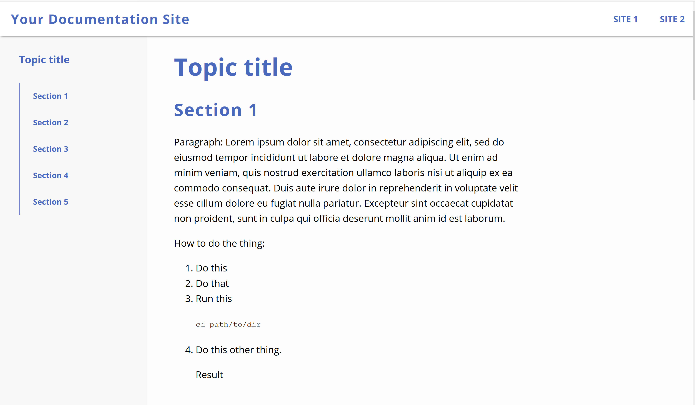

# fcc-tech-docs-page
Welcome to my freeCodeCamp Technical Documentation project!

It's a clean and simple page that lets you focus on reading technical content.

This is a responsive page designed for three different screen sizes.

## See the project description

This site is based on a coding challenge on FreeCodeCamp. However, I didn't follow the challenge description
perfectly. I included a top nav in addition to the required side nav, since I've found the top nav to be
an important resource in my own experience as a technical writer.

See the full
[challenge description here](https://www.freecodecamp.org/learn/responsive-web-design/responsive-web-design-projects/build-a-technical-documentation-page).

## See the site live

You can see the site live on [Codepen](https://codepen.io/NewWebAsh/pen/oNLRoPW?editors=0100)

## How to contribute

I'm not currently licensed to accept code contributions. However, if you have
any feedback or suggestions, please tweet me [@NewtonLanguages](https://twitter.com/NewtonLanguages).